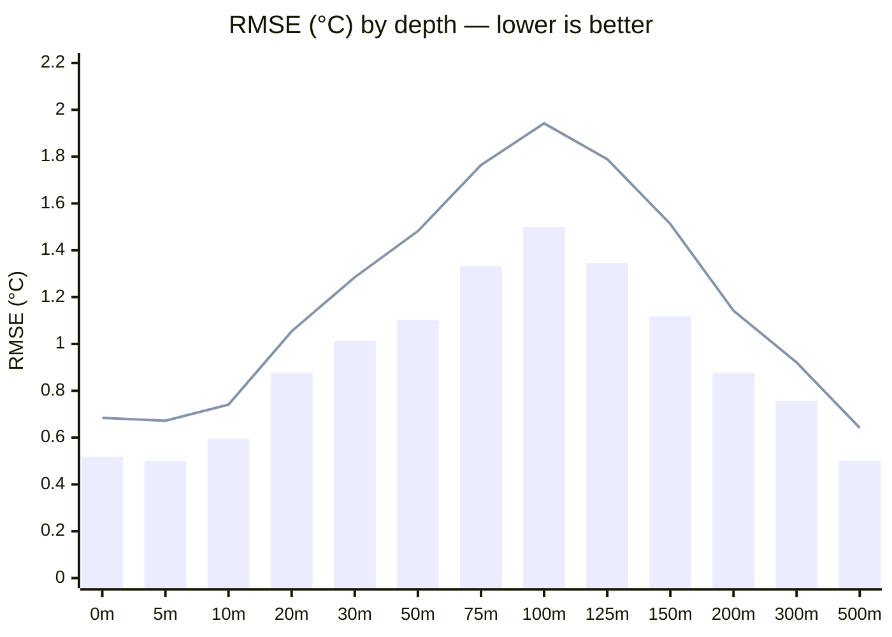
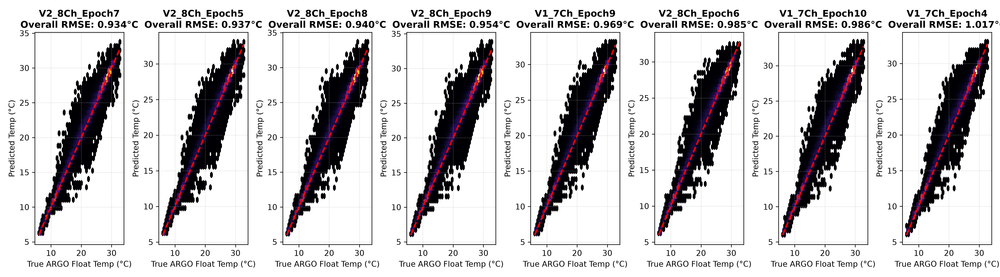
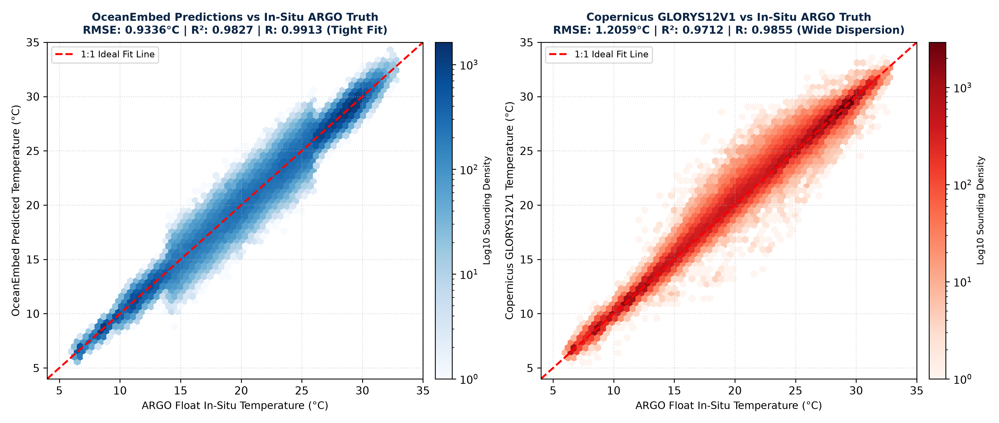
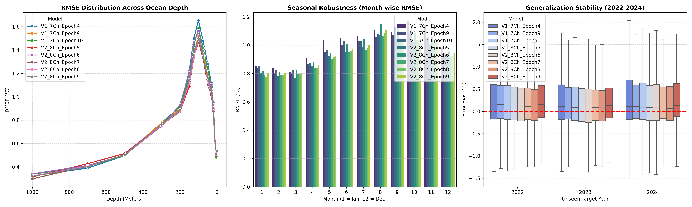
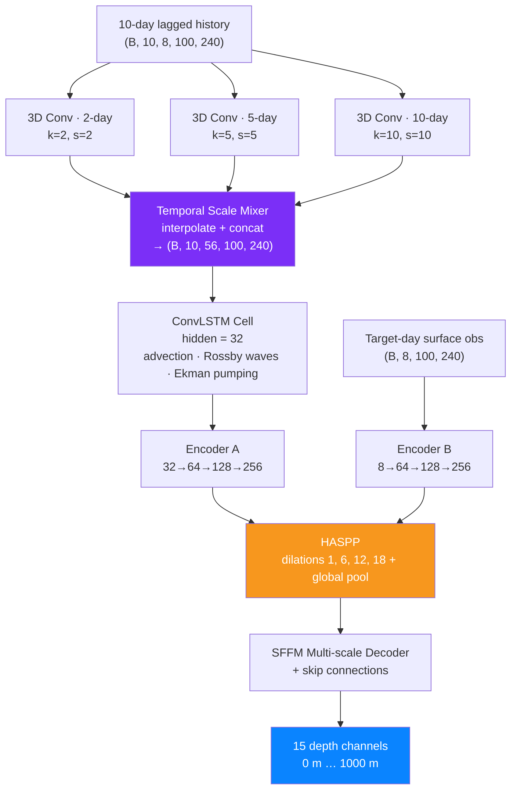

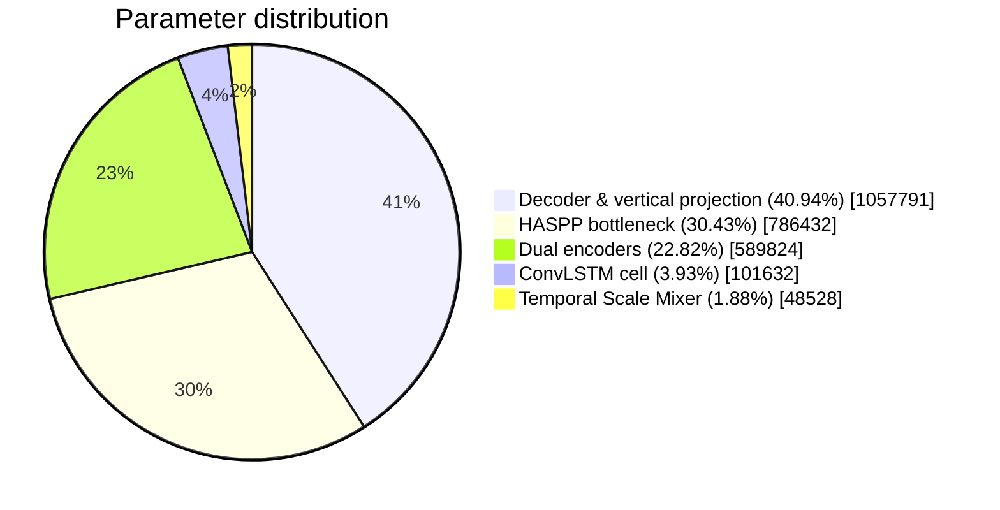
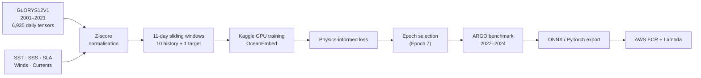
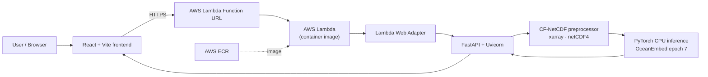

<div align="center">


# 🌊 OceanEmbed

### Seeing Beneath the Surface — AI Reconstruction of the Indian Ocean's 3D Thermal Structure from Satellite Data

**Satellite surface signals in → full 0–1000 m temperature column out. In milliseconds, on a CPU.**

[](https://ocean-embed.masir-projects.me/)
[](LICENSE)
[](#)


</div>

---

## 📑 Table of Contents

1. [The Problem](#-the-problem)
2. [Our Solution & What Makes It Novel](#-our-solution--what-makes-it-novel)
3. [Headline Results](#-headline-results-flex-zone)
4. [Model Architecture](#-core-model-architecture)
5. [Training Pipeline & Loss Design](#-training-pipeline--loss-design)
6. [Data Pipeline](#-data-pipeline)
7. [Benchmark Deep-Dive](#-benchmark-deep-dive)
8. [System Architecture & Deployment](#-system-architecture--deployment)
9. [Tech Stack](#-tech-stack)
10. [Repository Map](#-repository-map)
11. [Quick Start](#-quick-start)
12. [License](#-license--ip-notice)

---

## 🎯 The Problem

Satellites see only the **skin of the ocean** — sea-surface temperature, salinity proxies, height and winds. Yet the processes that govern monsoons, cyclone intensification, fisheries, ocean heat content and acoustic propagation live **beneath** the surface, in the **thermocline (50–150 m)**, where temperature can drop by more than 15 °C across tens of metres.

Direct subsurface observation relies on **ARGO profiling floats**, which are sparse in space and time. Numerical reanalyses such as Copernicus **GLORYS12V1** are physically rich, but are computationally heavy, delayed, and still show large errors in the thermocline.

> **Goal:** build a fast, lightweight, deployable AI system that reconstructs the full subsurface temperature column of the Indian Ocean from satellite-observable fields — and is *more accurate against real in-situ ARGO data than the reanalysis itself*.

---

## 💡 Our Solution & What Makes It Novel

OceanEmbed takes **11 days of 8 synchronised physical channels** (10-day lagged history + target-day surface observation) on a 0.25° grid (100 × 240) and outputs temperature at **15 standard depths from 0 m to 1000 m**.

| # | Novelty | Why it matters |
|---|---|---|
| 1 | **Temporal Scale Mixer (TSM)** — parallel 3D convs at 2-, 5- and 10-day scales | Ocean memory is multi-scale: inertial mixing, synoptic upwelling, mesoscale eddies/Rossby waves all captured in one block |
| 2 | **Spatiotemporal ConvLSTM memory** | Keeps the *spatial structure* of recurrent state, so eddies and fronts are tracked through time |
| 3 | **Dual-path U-Net encoder** (history state ⊕ target-day observation) | History provides "what the ocean remembers", target day provides "what the satellite sees now" |
| 4 | **Hybrid Atrous Spatial Pyramid Pooling (HASPP)** bottleneck, dilations 1/6/12/18 + global pooling | Links basin-scale wind forcing with localised thermocline features (e.g., off Kerala / Sri Lanka) |
| 5 | **SFFM multi-scale decoder** with skip connections → 15 depth channels | Reconstructs the whole vertical profile jointly |
| 6 | **Physics-informed, sparse-supervision loss** (`ArgoOceanPhysicsLoss`) | Trains directly on real, NaN-riddled ARGO floats, with a static-stability constraint and vertical-gradient fidelity |
| 7 | **Explicit ocean-mask channel** (V1→V2) | Cuts RMSE 0.9685 → **0.9336 °C** by teaching the net the land–sea boundary |
| 8 | **Tiny footprint**: 2.57M params, 9.87 MB | ~512 ms on CPU, ~38 ms on GPU → deployable serverless, even edge/ONNX |

---

## 🏆 Headline Results (Flex Zone)

Evaluated on **121,008 real in-situ ARGO soundings (INCOIS + international floats), 2022–2024 — a 100 % blind holdout never seen in training.**

| Metric | **OceanEmbed** | GLORYS12V1 | Margin |
|---|:---:|:---:|:---:|
| **RMSE** | **0.9336 °C** | 1.2059 °C | **−0.2723 °C (−22.58 %)** |
| **MAE** | **0.5899 °C** | 0.6036 °C | −0.0137 °C (−2.27 %) |
| **Pearson R** | **0.9913** | 0.9855 | +0.0058 |
| **R²** | **0.9827** | 0.9712 | +0.0115 (98.27 % variance explained) |
| **Mean Bias** | **−0.0184 °C** | +0.0421 °C | −0.0605 °C (near-zero drift) |
| **Thermocline peak RMSE (100 m)** | **1.4997 °C** | 1.9421 °C | −0.4424 °C (−22.78 %) |
| **Abyssal RMSE (1000 m)** | **0.2973 °C** | 0.3840 °C | −0.0867 °C (−22.58 %) |


> Bars: **OceanEmbed** · Line: **GLORYS12V1**. OceanEmbed wins at *every* depth; the largest gains (−0.38 to −0.44 °C) sit in the thermocline core, where physical and ML models usually fail.

<div align="center">

| Accuracy density vs ARGO truth | Side-by-side hexbins |
|:---:|:---:|
|  |  |



</div>

📄 Full report: [`benchmark_report.pdf`](models/evaluation/artifacts/benchmark_report.pdf)

---

## 🧠 Core Model Architecture



<div align="center"></div>

### Input — 8 physical channels (0.25° grid, 100 × 240)

| Ch | Variable | Unit | Role |
|---|---|---|---|
| 1 | `analysed_sst` | °C | Sea-surface temperature |
| 2 | `sos` | psu | Sea-surface salinity |
| 3 | `sla` | m | Sea-level anomaly (eddies, heat content) |
| 4–5 | `uwnd`, `vwnd` | m/s | 10 m wind (stress, mixing, upwelling) |
| 6–7 | `u`, `v` | m/s | Surface currents (advection) |
| 8 | `ocean_mask` | 0/1 | Land–sea boundary |

### Temporal Scale Mixer

| Branch | Scale | Physics captured |
|---|---|---|
| 2-day | high-frequency | wind-driven mixing, inertial oscillations |
| 5-day | synoptic | coastal upwelling, cyclones, depressions |
| 10-day | mesoscale | geostrophic eddies, Rossby waves, monsoon reversals |

### Parameter budget (2.58 M total · 9.87 MB)



---

## 🧪 Training Pipeline & Loss Design

Models were trained on **Kaggle GPUs**; preprocessing, analysis, evaluation and benchmarking were done locally in this repository.




### Leak-proof data splits

| Split | Years | Source | Samples | Purpose |
|---|---|---|---|---|
| Training | 2001–2021 (excl. 2005, 2012) | GLORYS12V1 | 6,935 daily tensors | Weight optimisation |
| Development test | 2005, 2012, 2022 | GLORYS12V1 (held out) | 1,095 daily tensors | Checkpoint selection / architecture search; tests resilience to IOD/ENSO anomalies |
| **Operational validation** | **2022–2024** | **INCOIS + ARGO floats** | **121,008 soundings** | **Blind real-world benchmark** |

### Unique loss — `ArgoOceanPhysicsLoss`

A composite, **sparse-supervised, physics-regularised** objective, computed in real °C (de-normalised) so error terms carry physical meaning:

$$
\mathcal{L} \;=\; \underbrace{\mathcal{L}_{\text{MSE}}^{\text{ARGO}}}_{\text{sparse in-situ fidelity}} \;+\; \alpha\,\underbrace{\mathcal{L}_{\text{phys}}}_{\text{static stability}} \;+\; \beta\,\underbrace{\mathcal{L}_{\text{grad}}}_{\text{thermocline gradient}},\qquad \alpha=0.05,\;\beta=0.1
$$

| Term | Definition | Purpose |
|---|---|---|
| **Sparse data loss** | MSE (and monitored MAE) in °C², averaged **only** over grid cells that have a real ARGO observation (NaN-masked, land-masked) | Learns from truly sparse, real floats instead of smooth reanalysis only |
| **Physics inversion penalty** | `mean( ReLU(T[z+1] − T[z])² )` over **all 15 depths of the whole basin** (ocean-masked) | Penalises unphysical warm-below-cold profiles, enforcing the stable-stratification prior everywhere — even where no float exists |
| **Sparse vertical-gradient loss** | `(ΔT_pred/Δz − ΔT_true/Δz)²` only where **two consecutive depths both** have ARGO data | Sharpens the thermocline instead of smoothing it out |

Design notes:
- NaNs are zeroed only *after* the observation mask is built → no gradient poisoning.
- Normalised by the count of valid points → stable under extremely variable float density.
- **Checkpoint selection**: Epoch 7 is the global optimum; epochs 8–9 show mild overfitting.

| Variant | RMSE | MAE |
|---|:---:|:---:|
| **V2 · 8-ch · Epoch 7 (production)** | **0.9336 °C** | **0.5899 °C** |
| V2 · Epoch 5 | 0.9367 °C | 0.5985 °C |
| V2 · Epoch 8 | 0.9398 °C | 0.5915 °C |
| V2 · Epoch 9 | 0.9543 °C | 0.6006 °C |
| V1 · 7-ch (no mask) · Epoch 9 | 0.9685 °C | 0.6103 °C |

---

## 🗄️ Data Pipeline

All handled in [`data_pipeline/`](data_pipeline/): authentication → download → preprocessing → assembly → land masking → normalisation.

| Variable | Source |
|---|---|
| Ocean physics (target, multi-depth) | Copernicus Marine — GLORYS12V1 |
| SST, SSS, SSH/SLA, currents | Copernicus Marine (CMEMS) |
| Winds | Reanalysis wind products |
| In-situ truth | INCOIS / international ARGO floats |

See [`docs/DATA_PIPELINE.md`](docs/DATA_PIPELINE.md) and [`docs/REPRODUCIBILITY.md`](docs/REPRODUCIBILITY.md).

---

## 🔬 Benchmark Deep-Dive

### Year-over-year zero-drift audit (no retraining)

| Year | ARGO soundings | OceanEmbed RMSE | GLORYS RMSE | OceanEmbed MAE | GLORYS MAE |
|---|---:|:---:|:---:|:---:|:---:|
| 2022 | 41,380 | **0.9525 °C** | 1.2310 °C | 0.6023 °C | 0.6184 °C |
| 2023 | 36,134 | **0.9004 °C** | 1.1742 °C | 0.5738 °C | 0.5891 °C |
| 2024 | 43,494 | **0.9426 °C** | 1.2095 °C | 0.5914 °C | 0.6042 °C |

### Basin & monsoon robustness (RMSE °C)

| Regime | OceanEmbed | GLORYS | Physics |
|---|:---:|:---:|---|
| Arabian Sea | **0.891** | 1.145 | Upwelling off Oman/Somalia, Findlater Jet |
| Bay of Bengal | **0.962** | 1.258 | Freshwater capping, barrier layers |
| Equatorial Indian Ocean | **0.948** | 1.214 | Kelvin/Rossby waves, Wyrtki jets |

Remains below ~0.97 °C even during the SW Monsoon (Jun–Sep), the most energetic season.

### Layer-by-layer verification (15 depths)

| Depth | Soundings | OceanEmbed RMSE | GLORYS RMSE | Advantage |
|---|---:|:---:|:---:|:---:|
| 0 m | 8,058 | 0.5184 | 0.6841 | −0.1657 |
| 10 m | 8,056 | 0.5954 | 0.7410 | −0.1456 |
| 30 m | 8,256 | 1.0141 | 1.2845 | −0.2704 |
| 50 m | 8,279 | 1.1006 | 1.4820 | −0.3814 |
| 75 m | 8,297 | 1.3316 | 1.7640 | −0.4324 |
| **100 m** | 8,293 | **1.4997** | 1.9421 | **−0.4424** |
| 125 m | 8,289 | 1.3451 | 1.7890 | −0.4439 |
| 150 m | 8,288 | 1.1177 | 1.5120 | −0.3943 |
| 200 m | 8,280 | 0.8756 | 1.1420 | −0.2664 |
| 300 m | 8,244 | 0.7575 | 0.9210 | −0.1635 |
| 500 m | 8,117 | 0.5018 | 0.6420 | −0.1402 |


---

## ☁️ System Architecture & Deployment

🌐 **Live:** **https://ocean-embed.masir-projects.me/**



- **Containerised** with Docker → pushed to **AWS ECR** → run on **AWS Lambda** (serverless, scales to zero).
- Accepts CF-standard NetCDF uploads (11-day, 8-channel) and returns the 15-depth temperature volume; ships demo caches for instant results.
- Also exports `oceanembed.onnx` for edge / browser-side runtimes.
- Details: [`backend/AWS_DEPLOYMENT.md`](backend/AWS_DEPLOYMENT.md).

---

## 🛠️ Tech Stack

<div align="center">

**AI / Deep Learning**

 


**Scientific Data**


**Backend & Cloud**


**Frontend**


</div>

| Layer | Technology |
|---|---|
| Model | PyTorch 2.3 (CPU build for serving), 3D Conv + ConvLSTM + U-Net/HASPP |
| Training | Kaggle GPU notebooks |
| Data | xarray, netCDF4, h5netcdf, NumPy, SciPy |
| API | FastAPI 0.111, Uvicorn, Mangum |
| Infra | Docker, AWS ECR, AWS Lambda (Function URL) |
| UI | React 19, Vite, React Router, Plotly.js |

---

## 🗂️ Repository Map

```text
data_pipeline/      # auth, download, preprocess, assemble, regional steps + notebooks
models/evaluation/  # evaluation notebooks, benchmark report, checkpoints, ONNX export
  ├─ artifacts/     # benchmark_report.pdf, figures, oceanembed.onnx
  ├─ checkpoints/   # oceanembed_epoch_7.pth
  ├─ notebooks/     # baseline, comparison, report
  └─ scripts/       # ARGO collocation extraction
backend/            # FastAPI app, Dockerfile, AWS deploy script
frontend/           # React + Vite web app
docs/               # DATA_PIPELINE.md, REPRODUCIBILITY.md
```


> Running the code locally is permitted for **evaluation purposes only** under the [license](LICENSE).

---

## 📜 License & IP Notice

**Copyright © 2026 Shreykumar Patel ([@ShreyData](https://github.com/ShreyData)), Masir, Jeenal, Kapil, Harshit, Khushi — Team ThreeSixNine. All Rights Reserved.**

This project is **proprietary**. It is published solely for review and evaluation by the Smart India Hackathon 2026 jury. Copying, reuse, redistribution, derivative works, or submission of this work (in whole or in part) in any other hackathon or competition are **strictly prohibited**. See [LICENSE](LICENSE).

<div align="center">

*Built with 🌊 for India's blue economy — Ministry of Earth Sciences · INCOIS*

</div>
